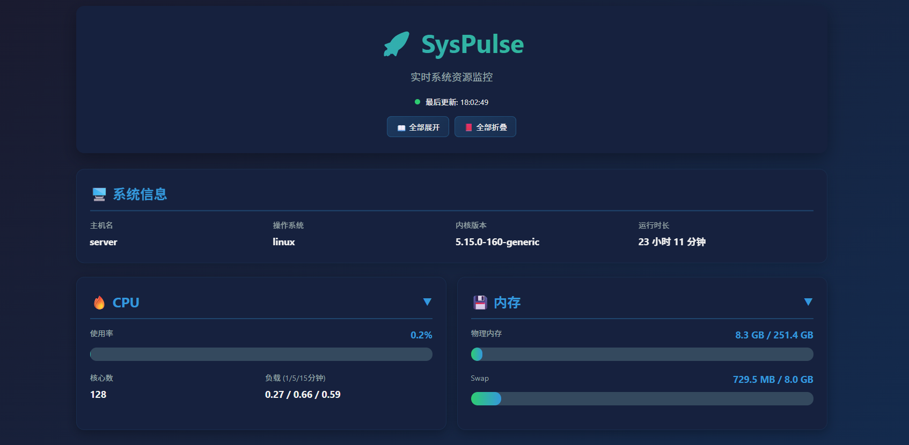
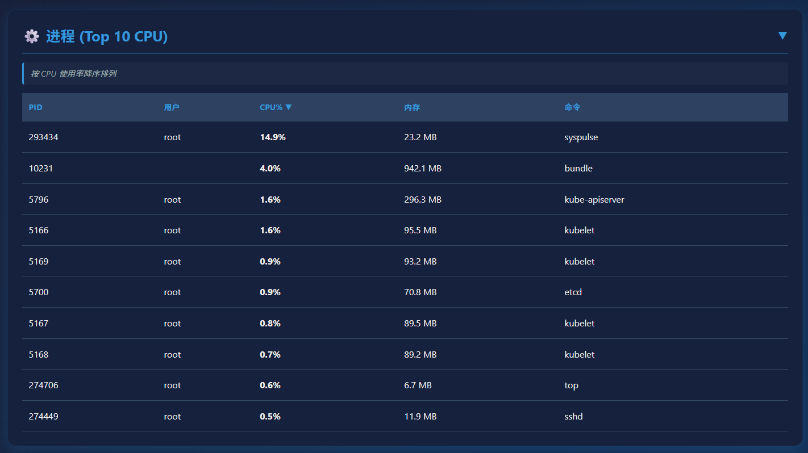
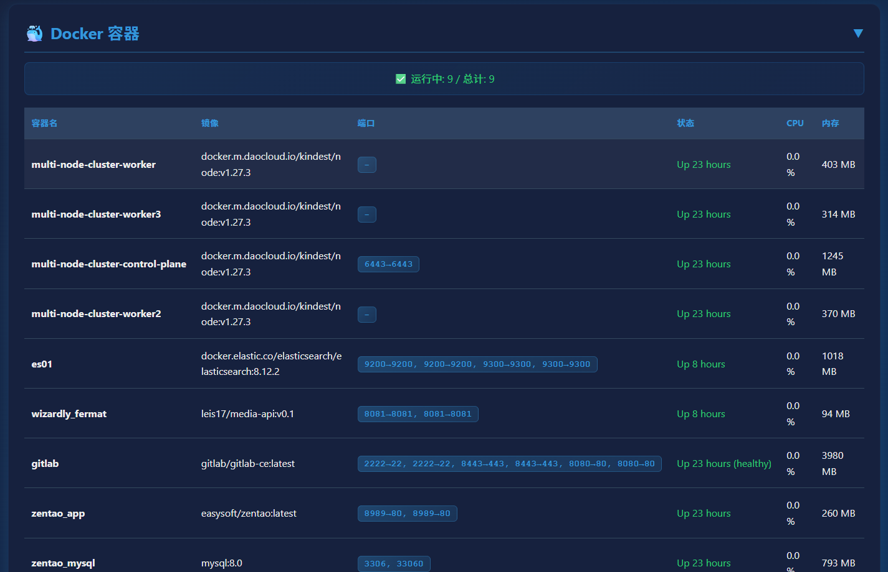

# SysPulse 🚀

<div align="center">
  <h3>超级易用的 Linux 系统资源监控工具</h3>
  <p>专为直观展示而设计 • 开箱即用 • 实时监控</p>
</div>

---

## ✨ 特性

- 🎨 **美观直观** - 彩色输出、表格展示、动态进度条
- 🐳 **Docker 支持** - 实时监控容器资源和运行状态
- 📊 **全面监控** - CPU、内存、磁盘、网络、进程
- ⚡ **实时刷新** - 动态更新系统状态（可自定义间隔）
- 🎯 **零配置** - 开箱即用，无需复杂设置
- 🚀 **高性能** - Go 编写，资源占用极低
- 💻 **易于使用** - 简洁的命令行界面，新手友好

## 🎬 快速预览

运行 `syspulse` 即可看到：

- ✅ 实时 CPU 使用率（总体 + 各核心）
- ✅ 内存和 Swap 使用情况
- ✅ 磁盘空间占用
- ✅ 网络流量统计
- ✅ Docker 容器状态和资源
- ✅ Top N 进程资源占用

## 📸 界面预览

### Web 界面

<div align="center">

#### 系统概览


#### 磁盘监控


#### 进程监控


#### Docker 容器监控


</div>

## 📦 安装

### 快速安装

```bash
# 1. 克隆项目
git clone https://github.com/YOUR_USERNAME/syspulse.git
cd syspulse

# 2. 运行安装脚本
chmod +x install.sh
./install.sh

# 3. 开始使用
syspulse
```

### 手动构建

```bash
# 确保安装了 Go 1.21+
go mod download
go build -o syspulse main.go

# 运行
./syspulse
```

### 使用 Makefile

```bash
make build    # 构建
make run      # 运行
make install  # 安装到系统（需要 sudo）
```

## 🚀 使用

### 方式 1: Web 界面（推荐）

启动 Web 服务器，通过浏览器查看：

```bash
./syspulse web

# 自定义端口
./syspulse web --port 8888

# 指定监听地址
./syspulse web --host 127.0.0.1
```

然后在浏览器中打开 `http://localhost:3000`

**Web 界面特性：**
- ✅ 实时数据自动刷新
- ✅ 美观的仪表盘布局
- ✅ 响应式设计，支持移动端
- ✅ 端口监听情况展示
- ✅ Docker 容器实时监控
- ✅ 进程资源占用排行

### 方式 2: 命令行界面

#### 查看所有资源（仪表盘）
```bash
./syspulse dashboard
# 或
./syspulse
```

#### 查看系统资源
```bash
# CPU 信息
./syspulse cpu

# 内存信息
./syspulse memory

# 磁盘信息
./syspulse disk

# 网络信息
./syspulse network

# 端口监听信息
./syspulse port

# 进程信息
./syspulse process
```

#### 查看 Docker 容器
```bash
# 所有容器概览
./syspulse docker

# 实时刷新（每 2 秒更新）
./syspulse docker --watch

# 查看特定容器详情
./syspulse docker --container <container-id>
```

### Web API

SysPulse 提供 RESTful API 和 WebSocket 接口：

```bash
# RESTful API
GET /api/system      # 系统信息
GET /api/cpu         # CPU 信息
GET /api/memory      # 内存信息
GET /api/disk        # 磁盘信息
GET /api/network     # 网络信息
GET /api/port        # 端口信息
GET /api/process     # 进程信息
GET /api/docker      # Docker 容器
GET /api/all         # 所有信息

# WebSocket (实时推送)
WS /ws?interval=2    # 实时数据推送
```

### 实时监控模式
```bash
# 实时刷新仪表盘（默认 2 秒）
./syspulse dashboard --watch

# 自定义刷新间隔（秒）
./syspulse dashboard --watch --interval 5
```

## 📊 输出示例

### 系统仪表盘

```
╔═══════════════════════════════════════════════════════════════════════╗
║                   💻 SYSTEM PULSE - 系统概览                          ║
╚═══════════════════════════════════════════════════════════════════════╝

🖥️  系统信息
  主机名: server-01
  操作系统: linux
  内核版本: 5.15.0-91-generic
  运行时长: 15 天 8 小时

🔥 CPU
  使用率: 45.3% ████████████████░░░░░░░░░░░░░░░░░░░░
  核心数: 8
  负载: 2.10 / 2.50 / 2.80

💾 内存
  物理内存: 12.5 GB / 16.0 GB ████████████████████████░░░░░░░░
  可用内存: 3.5 GB
  Swap: 2.1 GB / 8.0 GB ██████░░░░░░░░░░░░░░

💿 磁盘
  / 85.4 GB / 200.0 GB ██████████████████░░░░░░░░
  /home 120.5 GB / 500.0 GB █████████░░░░░░░░░░░░░

🌐 网络
  eth0: 192.168.1.100
    ↑ 2.5 GB  ↓ 15.3 GB

🐳 Docker 容器 (3 运行中 / 5 总计)
┌────────────┬───────────────┬─────────────┬───────┬────────┐
│ 容器名     │ 镜像          │ 状态        │ CPU   │ 内存   │
├────────────┼───────────────┼─────────────┼───────┼────────┤
│ nginx-web  │ nginx:latest  │ Up 5 hours  │ 2.3%  │ 128MB  │
│ mysql-db   │ mysql:8.0     │ Up 2 days   │ 15.7% │ 1.2GB  │
│ redis      │ redis:alpine  │ Up 1 day    │ 0.8%  │ 45MB   │
└────────────┴───────────────┴─────────────┴───────┴────────┘
```

### CPU 详细信息

```
╔═══════════════════════════════════════════════════════════════════════╗
║                          🔥 CPU 信息                                  ║
╚═══════════════════════════════════════════════════════════════════════╝

  型号: Intel(R) Core(TM) i7-9700K CPU @ 3.60GHz

  总体使用率: 45.3% ████████████████████████░░░░░░░░░░░░░░░░░░░░░░░░░░

  各核心使用率:
    核心  0: 52.1% ████████████████████████░░░░░░░░░░░░░░░░
    核心  1: 43.7% ████████████████████░░░░░░░░░░░░░░░░░░░░
    核心  2: 38.2% ███████████████░░░░░░░░░░░░░░░░░░░░░░░░░
    核心  3: 61.5% ████████████████████████████░░░░░░░░░░░░
    ...
```

## 🛠️ 技术栈

- **语言**: Go 1.21+
- **依赖库**:
  - `github.com/shirou/gopsutil/v3` - 系统信息获取
  - `github.com/docker/docker` - Docker API
  - `github.com/spf13/cobra` - CLI 框架
  - `github.com/olekukonko/tablewriter` - 表格显示
  - `github.com/fatih/color` - 彩色输出
  - `github.com/gorilla/mux` - HTTP 路由
  - `github.com/gorilla/websocket` - WebSocket 支持

## 🏗️ 项目结构

```
syspulse/
├── cmd/              # CLI 命令
│   ├── root.go      # 根命令
│   ├── dashboard.go # 仪表盘命令
│   ├── cpu.go       # CPU 命令
│   ├── memory.go    # 内存命令
│   ├── disk.go      # 磁盘命令
│   ├── network.go   # 网络命令
│   ├── port.go      # 端口命令
│   ├── process.go   # 进程命令
│   ├── docker.go    # Docker 命令
│   └── web.go       # Web 服务器命令
├── internal/
│   ├── monitor/     # 监控逻辑
│   │   ├── types.go     # 数据类型
│   │   ├── system.go    # 系统信息
│   │   ├── cpu.go       # CPU 监控
│   │   ├── memory.go    # 内存监控
│   │   ├── disk.go      # 磁盘监控
│   │   ├── network.go   # 网络监控
│   │   ├── port.go      # 端口监控
│   │   ├── process.go   # 进程监控
│   │   └── docker.go    # Docker 监控
│   ├── web/         # Web 服务器
│   │   ├── server.go    # HTTP 服务器
│   │   ├── handlers.go  # API 处理器
│   │   └── static/      # 静态文件
│   │       ├── index.html # Web 界面
│   │       ├── style.css  # 样式
│   │       └── app.js     # 前端逻辑
│   └── display/     # 显示逻辑
│       └── display.go   # 输出格式化
├── examples/        # 示例和文档
│   ├── usage.md           # 使用指南
│   ├── web-api.md         # Web API 文档
│   ├── systemd-service.md # 服务配置
│   ├── docker-compose.yml # 测试环境
│   └── config-example.yaml # 配置示例
├── main.go          # 入口文件
├── go.mod           # 依赖管理
├── Makefile         # 构建脚本
├── install.sh       # 安装脚本
├── README.md        # 项目说明
├── CONTRIBUTING.md  # 贡献指南
└── LICENSE          # 许可证
```

## 🤝 贡献

欢迎贡献！请查看 [CONTRIBUTING.md](CONTRIBUTING.md) 了解详情。

### 贡献者

感谢所有贡献者的付出！🎉

## 🐛 问题反馈

如果你遇到问题或有建议，请：

1. 查看 [Issues](https://github.com/YOUR_USERNAME/syspulse/issues) 看是否已有相关问题
2. 如果没有，欢迎 [创建新 Issue](https://github.com/YOUR_USERNAME/syspulse/issues/new)

## 📝 开发

```bash
# 克隆仓库
git clone https://github.com/YOUR_USERNAME/syspulse.git
cd syspulse

# 安装依赖
go mod download

# 开发模式运行
go run main.go

# 运行测试
go test ./...

# 格式化代码
go fmt ./...

# 构建
make build
```

## 🌟 Star History

如果这个项目对你有帮助，请给个 Star ⭐️

## 📄 许可证

本项目采用 MIT 许可证 - 查看 [LICENSE](LICENSE) 文件了解详情

## 🙏 致谢

感谢以下优秀的开源项目：

- [gopsutil](https://github.com/shirou/gopsutil) - 跨平台系统信息库
- [cobra](https://github.com/spf13/cobra) - 强大的 CLI 框架
- [tablewriter](https://github.com/olekukonko/tablewriter) - ASCII 表格生成
- [color](https://github.com/fatih/color) - 终端颜色输出

---

<div align="center">
  Made with ❤️ by SysPulse Contributors
</div>

